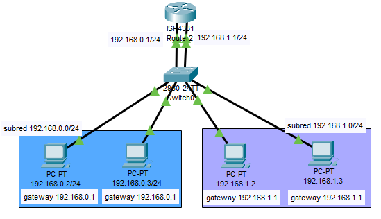

Estos casos van de más a menos, empezando por configuraciones sencillas de redes y subredes hasta configuraciones de vlan con trunk. El trabajar de esta forma nos permitirá entender los problemas que presenta cada solución y como se atajan estos problemas con las soluciones más avanzadas.
## 1 - Varios ordenadores conectados a un switch
Si conectamos varios ordenadores a un mismo switch tendremos conectividad entre los equipos que estén en la misma subred, pero no entre las subredes, **los switches sólo permiten comunicarse a los equipos que están en una misma subred**. 

## 2 - Varias subredes en un switch
Es posible añadir un router al escenario anterior para permitir conectividad entre las dos subredes. Necesitaríamos añadir dos cables desde el router hasta el switch, uno para la puerta de enlace de cada subred. En cada una de las interfaces del router deberemos establecer una ip que nos sirva como puerta de enlace para cada subred y que utilizaremos como gateway de los ordenadores de cada subred.
Este tipo de configuración, en la que se conecta un router a un switch y a ese switch los distintos dispositivos es conocida como router on a stick (router en un palo), es utilizado sobre todo en las vlan como veremos en casos posteriores.

#### Problemas de esta configuración
Con esta solución tenemos conectividad entre ambas subredes pero nos surge un problema. 
Los switches funcionan en la capa 2, es decir, no utilizan IP sino mac, en mac existe una dirección de broadcast al igual que en IP. 
Cuando un equipo se quiere conectar con otro en la capa 2, para encontrar al otro equipo manda un mensaje por la dirección de broadcast preguntando a todos los equipos quien tiene la dirección IP que busca, el equipo que la tenga responderá a esta petición indicándole que es él y empezará la conexión (protocolo ARP).
El problema está en que la dirección mac de broadcast es compartida por todos los dispositivos conectados al switch, independientemente de si pertenecen a la misma subred.
Entonces al enviar un mensaje entre dos equipos de una subred, la petición arp para ver que dispositivo es el que tiene la ip de destino se transmitiría entre todos los equipos del switch, no sólo los de la subred, esto además de causar saturación en la red (que puede ser mucha si hay muchas subredes), acarrea problemas de seguridad, por lo tanto, antes de las vlan, lo habitual era tener un switch por subred, con el coste que conlleva. Esto lo veremos en el siguiente caso.
## 3 - Varias subredes con un switch cada una
Partiendo del caso anterior, para llegar a esta configuración solo necesitamos agregar un switch, desconectar los ordenadores de una subred del otro switch y enchufarlos al nuevo y desenchufar el cable de la interfaz que viene del router para esa subred y enchufarlo también al nuevo switch, no es necesario hacer nada con la consola.
Las subredes tienen conectividad ya que están conectadas al mismo router por lo que no se necesita enrutamiento.

#### Problemas
Con esta solución evitamos el problema de que se comparta la dirección mac de broadcast, sin embargo, tenemos el problema de que necesitamos un switch para cada subred además de que el router tenga puertos suficientes para todas las subredes que necesitemos conectar, cosas que cuestan mucho dinero.
La solución definitiva para este problema son las vlan como veremos más adelante, aunque primero trataremos la conexión entre redes con distintos routers.
## 4 - Conexión entre redes con distintos routers
¿Que pasa si tenemos un router con varias subredes dentro de él y queremos conectarlo con otro router con otras subredes conectadas?
Para probarlos haremos un nuevo caso, en esta ocasión crearemos dos routers distintos, cada uno conectado a dos switches que tendrán una subred cada uno.
Para conectar estas redes entre sí conectaremos sus routers, para ello les añadiremos a los routers puertos serial y los conectaremos por esos puertos utilizando cable serial.
Deberemos crear una nueva subred para conecta los dos routers, esta será una red a parte de las de los switches de cada router, lo normal es elegir una subred con una máscara superior para no desperdiciar IPs sin embargo en este ejemplo hemos decidido utilizar una máscara /24 para que la notación en decimal quede más clara. Elegimos una ip distinta a las que estamos utilizando para las redes (10.0.0.0/24 en lugar de 192.168.x.0/24) solo para que quede más claro, realmente podría seguir también ese formato.
Debemos asignarle ips dentro de esa red a las interfaces de serial de los dos routers que hemos conectado.

Una vez realizado esto todavía no funcionará la conexión entre las redes de los diferentes routers ya que falta el enrutamiento. Un router solo conoce las redes que están conectadas directamente a él, por lo tanto, el router 1 no conoce las redes 192.168.2.0 ni la 192.168.3.0. Necesitamos indicarle al router por que camino debe seguir para encontrar esa red, en este caso por la ip 10.0.0.2/24 que es la de la interfaz del otro router que le tenemos conectado.
Hay dos formas de solucionar esto:
###### Con enrutamiento estático:
Dentro de cada router debemos configurar las rutas para cada una de las redes que no son adyacentes.
- En el primer router añadiremos una ruta estática para la red 192.168.2.0/24 a través de la ip 10.0.0.2 y otra para la 192.168.3.0/24 a través de la misma ip.
- En el segundo router añadiremos rutas estáticas para las redes 192.168.0.0/24 y 192.168.0.1/25 a través de la ip 10.0.0.1
###### Con enrutamiento dinámico RIP:
Debemos especificar en cada router cuales son sus redes adyacentes que desea "compartir". 
- Para el router 1 serán las redes 192.168.0.0, 192.168.1.0 y 10.0.0.0
- Para el router 2 serán las redes 192.168.2.0, 192.168.2.1 y 10.0.0.0

La solución con enrutamiento estático puede ser válida para entornos con unos pocos routers, pero en redes medianas o grandes rip es más adecuado ya que gestiona automáticamente las rutas, encontrando el camino más corto si hay varios o cambiando de camino si se elimina alguno.

## 5 - Configuración de un switch con dos vlan conectado a un router sin trunk
En este ejemplo dividiremos un switch en dos mediante el uso de vlan y lo conectaremos a un router sin hacer uso de trunk. Es funcionamiento es equivalente al del caso 3, pero ahorrándonos un router.

#### Problemas de esta solución
Aunque las subredes están aisladas, cada una en una vlan, por lo que no comparten dirección mac de broadcast aún estando en el mismo switch, necesitamos pasar un cable entre el router y el switch para la puerta de enlace de cada subred.
La solución a esto es usar puertos trunk, esto lo veremos en el siguiente caso

## 6 - Configuración de un switch con dos vlan conectado a un router con trunk
Se trata del mismo caso que el anterior, solo que en lugar de conectar una interfaz del router a cada vlan del switch, conectaremos un solo cable en modo trunk que transmitirá la información de todas las vlan.

## 7 - Dos switches con dos vlan repartidas entre ambos, con trunk
Este caso es similar al anterior, solo que utilizaremos dos switches para poder tener más dispositivos, asignaremos puertos de cada switch a cada vlan, ambos switches estarán conectados con un enlace trunk.

Como comprobamos con este ejemplo las vlan nos proporcionan la máxima flexibilidad al configurar redes, gracias al enlace trunk solo tenemos que conectar un cable entre cada dispositivo y podemos conectar cualquier dispositivo a cualquier switch y hacer que pertenezca a la vlan que queramos simplemente asignando ese puerto del switch a la vlan.

## 8 - Ejercicio de clase: vlan con trunk y enrutamiento

Este ejercicio es una combinación de los casos 7 y 4. Por un lado tendremos dos switches con dos vlan repartidas entre los dos conectados a un router. Por el otro router con otro switch y otra subred distinta. Ambos routers están conectados, por lo que será necesario realizar el enrutamiento, de manera estática o con rip para que las vlan puedan comunicarse con la otra red.