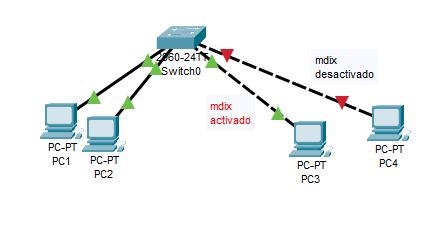

Al conectarnos a un dispositivo Cisco, como por ejemplo un switch obtendremos una terminal desde la que se puede configurar el dispositivo.

Al acceder a una terminal entraremos en el modo de ejecución de usuario (user EXEC mode). A través de comandos podremos navegar entre los diferentes modos y realizar cambios en la configuración del sistema.
# Modos de la consola
Al usar la consola nos iremos moviendo entre distintos modos utilizando comandos. Dentro de cada modo tendremos unos comandos disponibles para realizar. Estos comandos podrán consultar o cambiar configuraciones o movernos a otro modo.
Cada modo tiene un sufijo de nombre asociado, es decir, una etiqueta que se mostrará después del nombre del dispositivo en la consola.
Si por ejemplo tenemos un dispositivo llamado Router y estamos en el modo user EXEC mode nos aparecerá en la consola Router> pero si estamos en el modo privileged EXEC mode nos aparecerá Router#.
En esta tabla se muestran los modos con sus sufijos, de esta forma en los ejemplos por el sufijo ya sabremos en que modo estamos, aunque en la mayoría de ejemplos incluiremos los comandos que nos llevan a este modo para que quede más claro.

|                              | Sufijo          | Ejemplo para un dispositivo Router |
|------------------------------|-----------------|------------------------------------|
| user EXEC mode               | >               | Router>                            |
| privileged EXEC mode         | #               | Router#                            |
| global CONFIGURATION mode    | (config)#       | Router(config)#                    |
| interface CONFIGURATION mode | (config-if) #   | Router(config-if) #                |
| line CONFIGURATION mode      | (config-line) # | Router(config-line) #              |
| vlan CONFIGURATION mode      | (config-vlan) # | Router(config-vlan) #              |
## Como movernos por los modos
Esto se puede ver de forma clara en el esquema, aún así veremos aquí como movernos entre los modos . 
Desde global CONFIGURATION mode es desde el que se accede a todo el resto de modos, por lo que generalmente tendremos que pasar por el para llegar al modo que deseamos.
#### De user EXEC mode (>) a privileged EXEC mode (#)
Podemos movernos al modo privileged EXEC mode con el comando enable, se muestra el comando con una abreviatura:
```
Router> enable
Router> en
```
#### De privileged EXEC mode (#) a global CONFIGURATION mode ((config)#)
```
Router# configure ter
Router# conf t
```
Desde este modo podremos acceder al resto de modos.
#### Pasar el modo de configuración de una interfaz interface Config mode ((config-if) #)
Debemos mirar el nombre de la interfaz a la que queremos acceder, por ejemplo utilizando la lupa sobre el cable que conecta con la interfaz, por ejemplo, el nombre de la primera interfaz gigabit del router es Gig0/0/0.
Teniendo este nombre, desde el modo global Configuration mode
```
Switch(config)# int Gig0/0/0
```
#### Pasar el modo de configuración de las líneas de consola
```
! Configurar linea principal
Switch(config)#line con 0
! Configurar linea auxiliar
Switch(config)#line aux 0
! Configurar lineas de consola virtuales (para telnet)
Switch(config)#line vty 0 15
```
#### Pasar al modo de configuración de una vlan en un switch
Este comando además de acceder al modo de configuración de una vlan la crea si no existe.
```
! Para acceder a la vlan 10
Switch(config)#vlan 10
```
### Como volver atrás en los modos
Para volver el modo anterior podemos utilizar el comando **exit**, para volver al modo privileged EXEC mode, siempre que estemos en un modo posterior, podemos utilizar **end**.
Volver al modo anterior:
```
Router# exit
! volvemos al modo user EXEC mode
Router>
```
Volver al privileged EXEC mode:
```
Router(config-if)# end
! volvemos al modo privileged EXEC mode
Router#
```

## Trucos para manejarnos con la consola
### Uso de la interrogación ?
Si introducimos una interrogación ? nos mostrará cuales son los distintos comandos que podemos introducir junto con una descripción ( en ingles ): ).

Esto también se puede utilizar en medio de un comando, por ejemplo, si queremos cambiar la ip de una interfaz, estando en su modo de configuración tendríamos que escribir el comando
```
ip address 192.168.0.1 255.255.255.0
```
Estando en el modo de configuración, si introducimos el interrogación nos mostrará los comandos posibles, entre ellos el comando ip, aunque las descripciones no son muy intuitivas.

Pero si por ejemplo recordamos que el comando comienza por ip pero no recordamos como sigue podemos escribir ip y después la interrogación:
```
Router(config-if) # ip ?
access-group     Specify access control for packets
address          Set the IP address of an interface
authentication   authentication subcommands
...
```
Y ya nos indica que con address establecemos la dirección de la ip, entonces si introducimos ip address y luego la interrogación nos mostrará como usar el comando:
```
Router(config-if) # ip address ?
A.B.C.D    IP address
dhcp       IP Address negotiated via DHCP
```
Nos indicará que debemos introducir la dirección Ip en formato A.B.C.D. Pero si la introducimos y le damos a enter nos dará error ya que aún falta la máscara de red.
Si introducimos otra vez la interrogación nos mostrará que debemos introducir la máscara de red en el mismo formato:
```
Router(config-if) # ip address 192.168.0.1 ?
A.B.C.D IP subnet mask
```

Es muy útil por ejemplo con el comando show para ver que atributos podemos comprobar.

También se puede utilizar por el medio de una palabra para que nos muestre los comandos que coincidan con lo que tenemos escrito, por ejemplo si, en el mismo modo que estábamos, tenemos introducida una i y pulsamos la interrogación nos mostrará que los dos comandos que coinciden con lo que llevamos escrito son ip y ipv6:
```
Router(config-if)# i?
ip ipv6
```
### Uso del tabulador
Podemos utilizar el tabulador para autocompletar palabras, si por ejemplo, en el modo de user Exec Mode, si queremos utilizar el comando show, podemos escribir sh, darle a tabulador y nos autocompletará hasta show:
```
Router> sh(tabulador)
show
```
Funcionará cuando sólo haya una opción que coincida con lo que llevamos escrito, si queremos utilizar show e introducimos solo una s y le damos a tabular no funcionará ya que no sabe si queremos utilizar el comando show o el comando ssh.

### Abreviaturas de los comandos
Podemos utilizar cualquier abreviatura para un comando siempre que solo haya un comando que coincida con esa abreviatura, al igual que con el tabulador. De esa forma sh sería una abreviatura válida para show, pero s no lo sería porque no se sabría si es de show o de ssh. Si introducimos una abreviatura inválida nos dará un error diciendo que es ambigua. Junto con los comandos se mostrarán algunas abreviaturas habituales, aunque como digo podemos utilizar cualquier abreviatura válida según estos parámetros.

## Notas sobre el código de los ejemplos
En algunos ejemplos utilizaré una exclamación "!" delante de alguna línea. Esto significa que esta línea es un comentario. 
# Configuraciones básicas
## Guardar los cambios que hemos realizado, para que persistan tras reiniciar el equipo 
Podemos utilizar cualquiera de estos comandos desde el modo privileged EXEC mode, todos hacen lo mismo:
```
Switch# write
Switch# write memory
Switch# copy running-config startup-config
```
Lo más cómodo es utilizar la abreviatura
```
Switch# w
```
## Establecer el nombre de un equipo
Para ello debemos acceder al global configuration mode y utilizar el comando hostname para cambiarlo:
```
Router> enable
Router# configure terminal
Router(config)# hostname miRouter
! El dispositivo pasa a llamarse miRouter
miRouter(config)# 
```
### Establecer mensajes de login y motd
Los sistemas cisco permiten establecer un mensaje para el login (que se mostrará cuando pide la contraseña para acceder a la consola si está configurada o no se mostrará si no lo está) y otro mensaje conocido como motd (message of the day o mensaje del día) que se mostrará tras iniciar sesión, ya sea tras introducir la contraseña o directamente si esta no está configurada.

Ambos se configuran desde el global Configuration mode con el comando banner. Se introduce el comando banner seguido de motd o login para configurar cada uno de los modos y depués la primera línea del mensaje, tras introducirlo podemos continuar escribiendo líneas o finalizar introduciendo una h. En uno de los ejemplos se ha escrito un mensaje de varias líneas y en otro sólo de una:
Configurar mensaje de login (antes de iniciar sesión):
```
Router> enable
Router# configure terminal
Router(config)# banner login primera linea del mensaje
Enter TEXT message. End with the character 'h'.
Segunda línea del mensaje
Tercera línea del mensaje
h
```
Configurar mensaje de motd (después de iniciar sesión):
```
Router> enable
Router# configure terminal
Router(config)# banner motd única línea del mensaje
Enter TEXT message. End with the character 'h'.
h
```
## Contraseñas
Hay 2 tipos de contraseña que podemos configurar, una para acceder a la consola (real o virtual) y otra para acceder a al modo privileged Exec mode, que es a partir del cual se considera que tenemos permisos de administrador y nos permite entrar a los distintos modos de configuración.
### Establecer la contraseña para la consola
Las consolas, tanto la real como las virtuales que podemos utilizar desde telnet son líneas del equipo. Entonces para poner una contraseña al acceso tenemos que configurar una contraseña en las líneas pertinentes.

La línea de la consola principal, que es a la que accedemos cuando entramos desde el propio dispositivo o por otro conectado por cable de consola a este, es la línea 0. Podemos entrar al modo de configuración para esta línea de consola entrado al modo de configuración global y utilizando el comando line con 0.
```
Switch> enable
Switch# configure terminal
Switch(config)# line con 0
! establecemos la contraseña
Switch(config)# password miContraseña
! activamos el login para que se pida la contraseña
Switch(config)# login
Switch(config)# exit
Switch# write
```
Una vez establecida la contraseña y activado el login se puede acceder a la consola, desde cualquier equipo conectado a la toma de consola.

Hay que tener en cuenta que también existe otra línea de consola auxiliar a la que también podemos conectarnos con un cable, y si no se ha establecido una contraseña para esta podríamos acceder desde ahí sin contraseña. Para acceder a esta línea debemos utilizar desde el modo global CONFIGURATION mode el siguiente comando:
```
Switch(config)# line con aux
```
Y luego establecer la contraseña y el login como hicimos para la línea de consola principal
### Contraseña para acceder al privileged EXEC mode
El modo al que accedemos por defecto al conectarnos a la consola, es decir, el user EXEC mode no permite cambiar ninguna configuración, es a partir del privileged EXEC mode desde el que se considera que el usuario tiene permisos administrativos ya que le permite acceder a los distintos modos de configuración, por lo tanto, es habitual establecer otra contraseña para acceder a este modo, que se nos solicitará tas utilizar enable.

Para establecer esta contraseña tenemos que ir al global CONFIGURATION mode y utilizar **enable secret** o **enable password**, la diferencia es que si utilizamos secret la contraseña se guardará encriptada, por lo que proporciona más seguridad. Si tenemos establecidos ambos, solo funcionará el secret.
Con secret:

```
Switch> enable
Switch# configure terminal
Switch# enable secret contraseña
Switch(config)#exit
Switch# write
```
Con password:

```
Switch> enable
Switch# configure terminal
Switch# enable secret contraseña
Switch(config)#exit
Switch# write
```

## Como desactivar las contraseñas
Se puede utilizar "no" delante de un comando para negarlo. Esto no solo sirve para las contraseñas sino para prácticamente cualquier cosa que se pueda activar y desactivar.
### Desactivar contraseña consola:
```
Switch> enable
Switch# configure terminal
Switch# line con 0
Switch(config-line)# no password
Switch(config-line)# no secret
Switch(config-line)# no login
Switch(config-line)# end
Switch# write
```

### Desactivar contraseña privileged EXEC mode:
```
Switch> enable
Switch(config)# configure terminal
Switch(config)# no enable password
Switch(config)# no enable secret
Switch(config)# end
Switch# write
```

## Terminales virtuales (Telnet)
Para habilitar el acceso a un equipo por telnet seguimos el mismo proceso que para introducir una contraseña para la línea de consola pero con las líneas virtuales, en este caso no será necesario activar login.
```
Switch> enable
Switch# configure terminal
Switch(config)# line vty 0 15
Switch(config-line) password contraseñaParaTelnet
Switch(config-line) end
Switch# write
```

Si se trata de un switch, será necesario asignar una IP a la VLAN por defecto (en la que están todos los puertos por defecto), ya que para conectarnos por telnet necesitamos una ip, para esto:
```
Switch> enable
Switch# configure terminal
Switch(config)# int VLAN 1
Switch(config-if) ip address 192.168.0.2 255.255.255.0
Switch(config-if) no shutdown
Switch(config-if) end
Switch# write
```
Si el ordenador desde el que queremos acceder esta configurado en otra vlan tendremos que asignarle la ip a esa.

Tras esta configuración podríamos acceder al equipo por telnet desde cualquier equipo que tenga conectividad ip con él. Si no hemos configurado una contraseña para el privileged EXEC mode (enable) no nos permitirá acceder a este modo desde telnet.

# Configuraciones de los routers
## Asignar una IP a una interfaz y levantarla.
Pongamos que tenemos un router conectado a un switch. Queremos que el router utilice la IP 192.168.0.1/24 para esa interfaz, que servirá como puerta de enlace para los equipos que tenemos conectados al switch.

Para hacer esto, primero necesitaremos comprobar que interfaz del router estamos usando (podemos mirarlo con la lupa sobre el cable en el packet tracer) y acceder a su interface CONFIGURATION mode. Desde este modo podremos establecer la ip con el comando **ip address**. Además deberemos levantar (encender) la interfaz con el comando no shutdown.
Utilizando la interfaz gig0/0/0
```
Router> enable
Router# configure terminal
Router(config)# interface gig0/0/0
Router(config-if)# ip address 192.168.0.1 255.255.255.0
Router(config-if)# no shutdown
```
## Enrutamiento
Si queremos conectar dos redes que están conectadas a routers distintos, además de tener que crear una nueva red para la conexión entre los routers tendremos que configurar el enrutamiento en cada router.
![[img/enrutamiento 3.png]]
Esto se debe a que cada router solo conoce las redes que están directamente conectadas a él, por lo tanto, el router 0 no conoce la existencia de la red 192.168.1.0, así que cuando el ordenador 192.168.0.2 intente mandarle un mensaje al 192.168.1.2 no podrá ya que este llegará al router 0 y este no sabrá a donde enviarlo.
Para solucionar este problema hay que indicarle a cada router la dirección a la que debe enviar los datos que vayan a cada red no adyacente. Hay dos maneras de realizar esto, enrutamiento estático y enrutamiento rip.
Esto se trata más a fondo en el caso 4 de los casos prácticos.
### Enrutamiento estático
En este tipo de enrutamiento, indicamos directamente en cada router a donde debe mandar los paquetes que vayan a cada red no adyacente. Puede servir para redes pequeñas con pocos routers pero se hace inmanejable en redes grandes.
En el caso de ejemplo tendríamos que añadir en el router 0 una ruta estática que indique que para llegar a la red 192.168.1.0/24 tiene que pasar por 10.0.0.2. En El router 1 habría que añadir una ruta estática que para llegar a la red 192.168.0.10 tiene que pasar por 10.0.0.1.

La dirección a la que se envía, en este caso 10.0.0.1 o 10.0.0.2 debe ser la de un equipo conectado directamente al router, se llama la dirección del siguiente salto, en caso de haber varios routers de por medio, en cada router habría que ir configurando el siguiente como siguiente salto para cada red.

Para añadir una ruta estática a un router debemos entrar en el global CONFIG mode y añadirla con el comando **ip route**
Funcionamiento:
```
ip route <red a la que dar el salto> <máscara de la red> <siguiente salto>
```
Por ejemplo:
```
Switch> enable
Switch# configure terminal
Switch(config)# ip route 192.168.1.0 255.255.255.0 10.0.0.2
```
### Enrutamiento RIP
En este tipo de enrutamiento simplemente indicamos en cada router las redes adyacentes que se desean compartir. Automáticamente los routers se configurarán y utilizarán la mejor ruta para cada uno de los mensajes en cada momento, si hay varios caminos se elegirá el más corto y podrá ir variando según vaya cambiando la red. Es más adecuado para redes medianas o grandes.

Para configurarlo debemos acceder al router RIP configuration mode de cada router y utilizar el comando **network** para añadir cada red adyacente (no es necesario indicar máscara):
```
Switch> enable
Switch# configure terminal
Switch(config)# router rip
Switch(config-router)# network 192.168.0.0
```
# VLAN
Las vlan consisten en dividir los puertos de un switch virtualmente, haciendo que funcione como varios switches distintos.
## VLAN vs Subred
No es lo mismo una subred que una vlan, mientras que una subred es un concepto de capa 3 (ip) las vlan consisten en dividir un switch en varios switches virtualmente, haciendo que se comporte como varios switches distintos. Sin embargo, en el proceso de creación de redes existe una norma llamada KIS (Keep It Simple, o mantenlo simple), que nos dice que la red debe ser lo más sencilla posible, debido a esto lo habitual es asignar una subred a cada vlan.

Esto no quiere decir que configuraciones con varias subredes dentro de una vlan o con subredes repartidas entre distintas vlan no sean posibles, solo que se intentarán evitar a la hora de crear una red, ahora bien, es posible que se tengan que implementar en casos donde ya haya una infraestructura anterior y no se desee modificar esta.

Pero **en principio, en los ejercicios que hagamos y los ejemplos que tratemos, asignaremos una subred a cada vlan**.
## Crear una vlan y ponerle nombre
```
Switch> enable
Switch# configure terminal
Switch(config)# VLAN 10
Switch(config-vlan)# name nombre
Switch(config-vlan)# end
Switch# write
```
### Asignar puertos del switch a una vlan
Se puede hacer para un puerto en específico, por ejemplo para asignar el puerto gig/0/0/0 a la vlan 10:
```
Switch> enable
Switch# configure terminal
Switch(config)# int gig0/0/0
Switch(config-if)# switchport mode access
Switch(config-if)# switchport access vlan 10 
Switch(config-if)# end
Switch# write
```
O para un rango, por ejemplo para asignar los puertos de fa0/0 a fa0/10 a la vlan 10:
```
Switch> enable
Switch# configure terminal
Switch(config)# int range fa0/0-10
Switch(config-if)# switchport mode access
Switch(config-if)# switchport access vlan 10 
Switch(config-if)# end
Switch# write
```

De esta forma ya podríamos tener un switch separado en dos, cada vlan se comporta como un switch distinto y evitan de esta forma compartir dirección de broadcast mac entre las distintas subredes conectadas a cada switch, pero tendríamos que tener un cable del router conectado a cada vlan del switch. Además, si queremos tener varios switches conectados, necesitaremos tener diferentes diferentes cables para las interfaces que pasen por esos routers.
### Ejemplo
![[img/ejemplo sin trunk 3.png]]

Como vemos en este ejemplo, para tener una cadena de 3 switches, cada uno con una vlan, debemos pasar 3 cables del router al primer switch, uno para cada vlan, del switch 1 al 2 debemos pasar dos cables, uno para la vlan 20 y otro para la 30 y del segundo al tercero otro cable para la vlan 30. Esto evidentemente se complica cuando hay muchas vlans, haciendonos necesitar demasiados cables y demasiados puertos del router, lo cual supone mucho gasto. La solución a esto son los enlaces Trunk.
## Enlace Trunk
Consiste en pasar un único cable entre cada dispositivo que vayamos a conectar. Ese mismo cable transportará los datos de todas las vlans que queramos, evitándonos necesitar utilizar un cable y puertos para cada vlan.
Esto es posible gracias al protocolo 802.1q, este protocolo lo que hace es añadir a cada mensaje una etiqueta que indique la vlan a la que pertenece, de esta forma el tráfico de todas las vlan puede pasar por el mismo cable y los switches y routers se encargarán de redirigirlo automáticamente.

Para utilizar enlaces trunk debemos configurar en cada switch los puertos que se utilizarán como trunk. 
En el router tendremos que crear una subinterfaz por cada vlan en la interfaz que utilicemos como trunk.

Veremos como hacer ambas cosas
### Configurar puerto del switch en modo Trunk
Desde el interface CONFIG mode de la interfaz a configurar, para configurarla como trunk utilizaremos el comando: 
```
switchport mode trunk
```
 Y para seleccionar las vlans que permitiremos que pasen por este puerto, utilizaremos el comando:
 ```
 switchport trunk allowed vlan <vlans permitidas>
```
Se pueden introducir una o varias vlans separadas por una coma o introducir all para permitir todas las vlan.
Por ejemplo:
Para configurar la interfaz fa0/1 de un switch como trunk y permitir por ella el paso de las vlan 10 y 20:
```
Switch> enable
Switch# configure terminal
Switch(config)# int fa0/1
Switch(config-if)# switchport mode trunk
Switch(config-if)# switchport trunk allowed vlan 10,20
Switch(config-if)# end
Switch# write
```
Para configurar la interfaz fa0/1 de un switch como trunk y permitir por ella el paso de todas las vlan:
```
Switch> enable
Switch# configure terminal
Switch(config)# int fa0/1
Switch(config-if)# switchport mode trunk
Switch(config-if)# switchport trunk allowed vlan all
Switch(config-if)# end
Switch# write
```
Ojo, es necesario crear las vlan en los switches por los que vayan a pasar por sus puertos trunk, aunque no tengan ningun puerto de acceso asociado a esa vlan, si no no se transmitiran los datos para estas vlans y no funcionarán.

Con esta configuración podemos conectar varios switches entre ellos con un solo cable entre cada uno y el tráfico de las vlan se transportará por ese cable, veamos como hacer lo mismo para el router.
### Configurar subinterfaces del router para vlan
En el router, en la imagen de ejemplo sin trunk, teníamos 3 cables conectados entre el router y el switch 1, uno por cada vlan y en cada una de las 3 interfaces del router utilizadas le asignábamos la ip que utilizaremos como puerta de enlace para cada vlan. Como queremos tener un solo cable conectado a una sola interfaz del router, tendremos que asignar las 3 direcciones de puerta de enlace en una misma interfaz.
Para esto crearemos subinterfaces de esta interfaz y le asignaremos a cada una de las subinterfaces la ip necesaria.

#### Acceder a subinterfaz y crearla
Para crear una subinterfaz de una interfaz, hacemos como para acceder al modo interface CONFIG mode de esa interfaz, pero añadiendo después de la interfaz un punto y el id numérico que queramos asignarle.  De esta forma accederemos al modo interface CONFIG mode de esa subinterfaz creándola si ni existe.

Acceder a una subinterfaz (la crea si no existe):
```
Router> enable
Router# configure terminal
Router(config)# int interfaz.idNumérico
```
Por ejemplo para acceder (y crear si no existe) a la subinterfaz 10 de la interfaz gig0/0/0 de un router:
```
Router> enable
Router# configure terminal
Router(config)# int gig0/0/0.10
```
#### Activar protocolo 802.1q para una subinterfaz y vincularla a una vlan
Debemos activar el protocolo 802.1q en la subinterfaz para permitir el funcionamiento con paquetes que utilicen este protocolo (que como explicamos anteriormente es el que se encarga se gestionar que varias vlan compartan cable) e indicarle con que vlan tiene que asociar cada subinterfaz. 
Estando en el modo interface CONFIG mode de esa subinterfaz, para activar el protocolo y asignarle una vlan a una subinterfaz utilizamos el comando
```
Router(config-if)# encapsulation dot1q <vlan a asociar con la interfaz>
```
Por ejemplo, para activar el protocolo 802.1q en la subinterfaz 10 de la interfaz gig0/0/0 de un router y asociarla con la vlan 10:
```
Router> enable
Router# configure terminal
Router(config)# int gig0/0/0.10
Router(config-if)# encapsulation dot1q 10
```
Ojo, no tiene por que coincidir el nombre de la subinterfaz con el de la vlan, aunque es recomendable para que sea más fácil de ver.
#### Asignar una ip a la subinterfaz
Una vez activado el protocolo 802.1q y asignada la vlan a una interfaz debemos establecer la ip con la que funcionará y que servirá de puerta de enlace para los dispositivos de la subred que contiene. Para establecer esta ip, desde el modo interface CONFIG mode de la subinterfaz utilizamos el comando ip address de la misma manera que hacemos para configurar la ip de una interfaz normal.
Por ejemplo para establecer la ip 192.168.0.1/24 para la subinterfaz 10 de la interfaz gig0/0/0 del router:
```
Router> enable
Router# configure terminal
Router(config)# int gig0/0/0.10
Router(config-if)# ip address 192.168.0.1 255.255.255.0
```
Con estas configuraciones listas ya solo necesitamos pasar un cable entre cada switch o router independientemente de las vlan que haya.
### Ejemplo
![[img/ejemplo con trunk.png]]
Haremos el mismo ejemplo que para las vlans sin trunk, ahora solo es necesario pasar conectar un cable entre cada dispositivo

Aunque aquí hemos utilizado un switch para cada vlan para hacerlo más claro no estamos limitados por esta configuración, podemos tener varias vlans en cada switch o incluso vlans repartidas entre varios switches sin ningún problema.
## Switches Capa 3
Los switches de capa 3, como su propio nombre indica, son switches con ciertas capacidades de capa 3 (routers). La diferencia con los normales es que pueden asignarle a las interfaces asociadas a cada vlan una ip, que se puede utilizar como puerta de enlace para los hosts de esa vlan y de esta manera permitir la comunicación entre las subredes de cada vlan sin la necesidad de un router
#### Asignarle una ip a la interfaz de una vlan
Cuando creamos una vlan se nos crea una interfaz asociada. Se le puede asociar una ip a esa interfaz, esto solo tiene sentido en switches de capa 3 o en capa 2 si necesitamos asignarle una ip para acceder a la consola de configuración, como explicamos en el apartado de telnet.
Para asignarle una ip a la interfaz de una vlan entramos en su interface CONFIGURATION mode y la establecemos con ip address como haríamos con las interfaces del router. No es necesario utilizar no shutdown ya que estas interfaces se levantan automáticamente la primera vez que accedemos a su interface CONFIGURATION mode.
Por ejemplo para establecer la ip 192.168.0.1/24 para la interfaz de la vlan 10:
```
Switch> enable
Switch# configure terminal
Switch(config)# int VLAN 10
Switch(config-if)# ip address 192.168.0.1 255.255.0.0
Switch(config-if)# end
Switch# write
```
#### Activar el enrutamiento entre las vlans
Desde el global Config mode utilizamos el comando **ip routing**:
```
Switch> enable
Switch# configure terminal
Switch(config)# ip routing
Switch(config)# end
Switch# write
```
Con esta configuración las subredes de las vlans del switch de capa 3 tendrían conectividad entre ellas, sin necesidad de router.

## MDIX y tipos de cable
En packet tracer tenemos cables directos (straight through) y cruzados (crossover), además de los cables seriales. Los cables directos se utilizan para conectar dispositivos de distinto tipo (generalmente que funcionan en la misma capa) y los cruzados para equipos similares.

Por ejemplo, para conectar un router a un switch o un switch a un ordenador utilizaremos cable directo ya que son dispositivos de distinto tipo.
En cambio, si conectamos dispositivos del mismo tipo, como pueden ser dos switches, o un router con un ordenador (ya que ambos operan en capa 3), deberíamos utilizar cable cruzado.

Sin embargo esto no es un problema gracias al protocolo MDIX de cisco, que detecta automáticamente el tipo de cable que estamos utilizando y hace que los dispositivos funcionen adaptándose a el, por lo que en la práctica podemos utilizar cualquier cable para conectar cualquier dispositivo.

Este protocolo viene activado por defecto, para desactivarlo tenemos que entrar al modo interface CONFIG mode de la interfaz en la que lo queramos desactivar y ejecutar el comando **no mdix auto**. Por ejemplo, para hacerlo sobre la interfaz fa0/1 de un switch:
```
Switch> enable
Switch# configure terminal
Switch(config)# int fa0/1
Switch(config-if)# no mdix auto
Switch(config)# end
Switch# write
```

En este ejemplo podemos ver varios ordenadores conectados a un switch. Los ordenadores conectados con cable directo tienen conectividad ya que es el cable correcto para este tipo de conexión. 
PC3 y PC4 están conectados por cable cruzado, sin embargo PC3 tiene conectividad por que en la interfaz del switch a la que está conectado está activado MDIX (configuración por defecto). En la interfaz del switch a la que está conectado PC4 se ha desactivado MDIX, por lo que este no tiene conectividad