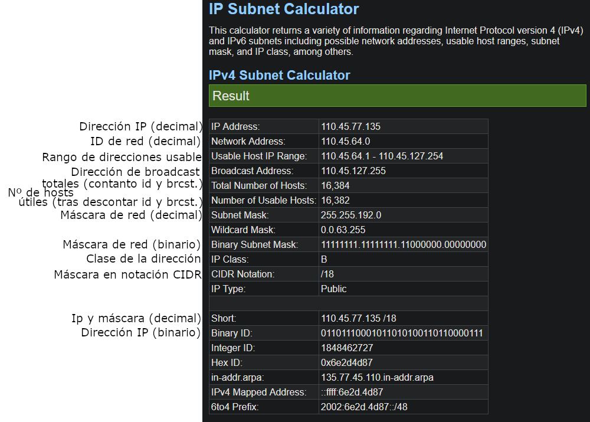

# Crear enunciados válidos
Para plantear un ejercicio que sea válido hay que tener en cuenta que la máscara de red debe ser igual o superior a la predeterminada de la clase de la IP.

Estas son las clases de Ip que debemos tener en cuenta (existen más pero no se utilizan), junto con sus máscaras predeterminadas:

| Clase | Primer byte (en decimal) | Máscara por defecto |     |
| ----- | ------------------------ | ------------------- | --- |
| A     | 0 a 127                  | 255.0.0.0 (/8)      |     |
| B     | 128 a 191                | 255.255.0.0 (/16)   |     |
| C     | 192 a 223                | 255.255.255.0 (/24) |     |

Por lo tanto, si queremos usar una Ip cuyo primer byte en decimal esté entre 0 y 127, tendremos que ponerle siempre una máscara igual o superior a /8, si está entre 128 y 192 una igual o superior a /16 y así.

Por ejemplo la dirección 145.23.52.1/10 no sería válida ya que al empezar por 145 es una Ip de clase B y su máscara tendrá que ser igual o mayor que 16.
# Comprobar fácilmente los resultados
Utilizaremos la página:
[https://www.calculator.net/ip-subnet-calculator.html](https://www.calculator.net/ip-subnet-calculator.html)
Al acceder nos aparecerá esta página:

Utilizaremos la calculadora que pone IPv4 Subnet Calculator, Network Class lo dejaremos en Any, en subnet seleccionaremos la máscara y en IP address introducimos la dirección Ip. 

Tras darle a Calculate nos aparecerá una tabla con los datos que necesitamos:

El único dato que no aparece es el ID de red en binario, para obtenerlo podemos utilizar esta página que convierte IPs de decimal a binario, solo tendremos que introducir el id de red en decimal:
[https://miniwebtool.com/es/ip-address-to-binary-converter/](https://miniwebtool.com/es/ip-address-to-binary-converter/)