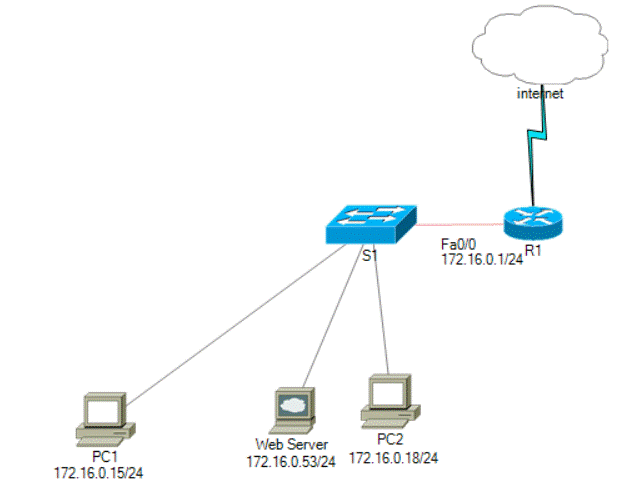

#### **UDP es un protocolo de la capa de Internet que...**
**Seleccione una:**
**a. No confirma la transmisión correcta de datagramas.**
**b. Habilita un proceso que se ejecuta en un host para enviar paquetes a un proceso que se ejecuta en otro host.**
**c. UDP no es un protocolo de la capa de Internet.**
**d. A diferencia del protocolo TCP, permite la comunicación confiable entre los procesos que se ejecutan en hosts independientes**

##### Respuesta: La A
TCP está orientado a conexión, cada vez que se envía un datagrama (mensaje) el que lo recibe confirma que lo ha recibido y en caso de haber algún error lo indica y se envía de nuevo, ambos equipos se mantienen conectados durante todo el rato que se envían mensajes.

UDP es no orientado a conexión, simplemente envía el mensaje, sin esperar confirmación ni comprobar errores ni nada, debido a esto es más rápido pero menos fiable.

Para casi todas las conexiones tipo internet o la mayoría de servicios funcionan por TCP. UDP se utiliza en cosas que requieren funcionar muy rápido y no pasa nada si falla, por ejemplo en videojuegos online.

#### **¿Cuál es la dirección de la red LAN que se muestra en la siguiente representación gráfica?. Señale la opción más exacta.**

Seleccione una:
a. 172.16.0.255
b. 172.16.0.0/16
c. 172.16.0.0

##### Respuesta: La B
Lo que nos preguntan es la dirección de red, que es la primera del rango. La opción A ya sabemos que no es porque es 172.16.0.255, entonces los pcs tendrían que tener ips superiores a esa y ya vemos que no.

La b y la c son la misma IP solo que una nos indica la máscara y la otra no. Comprobamos que la máscara de la opción B coincide con todos los equipos que salen y vemos que sí, porque es /16, esto significa que cogemos hasta el segundo byte para la dirección de red, ósea que todos los equipos tendrían que ser 172.16. … . Como esto se cumple sería válida. La c también coincide pero como nos pide la más exacta sería la B. Si por ejemplo hubiera otra opción con la misma IP pero máscara /24 también sería válida y como sería más exacta que la /16 elegiríamos esa, pero de las que nos indican la B es la más exacta.

#### **Entre otras funciones, la capa de transporte de OSI es la encargada de:**

**Seleccione una:**
**a. La comunicación entre el emisor y el receptor.**
**b. La transferencia de ficheros.**
**c. La compresión de los datos.**
**d. Ninguna de las anteriores.**

##### Respuesta: La A  

La capa de transporte es la que utiliza TCP o UDP para transmitir los mensajes entre los dispositivos. Es la capa que gestiona IP (tcp o udp funcionan dentro de IP, es decir, dentro del mensaje IP se indica si es un mensaje tcp o udp y se adjuntan los datos a transmitir.

#### **Seleccione la opción que NO ES una característica propia del protocolo IP.**
**Seleccione una:**
  
a. Baja sobrecarga.
b. Independiente de los medios.
c. Minimo esfuerzo.
d. Sin conexión.

##### Respuesta: La D
En esta me hace dudar lo de baja sobrecarga. Realmente a mi entender no es una característica propia del protocolo IP, más bien es algo que se ha logrado gracias a los switches y demás dispositivos eficientes que se han creado a posteriori, pero no se diseñó pensando en eso.

Sin embargo, la opción d sí que no hay por donde cogerla ya que IP sirve precisamente para conectar ordenadores así que la d.

  
#### Atendiendo al siguiente gráfico, el PC está conectado al puerto de consola del Switch. Todas las demás conexiones se realizan a través de enlaces FastEthernet (Ethernet a 1000 Mbps). ¿Qué tipo de cables UTP se pueden utilizar para conectar los dispositivos?

Seleccione una:

a. 1 CRUZADO - 2 CONSOLA - 3 DIRECTO
b. 1 CONSOLA - 2 CRUZADO - 3 DIRECTO
c.  1 CRUZADO - 2 DIRECTO - 3 CONSOLA
d. 1 CONSOLA - 2 DIRECTO - 3 CRUZADO

##### Respuesta: La D

El cable directo se utiliza para conectar dispositivos de distinto tipo, por ejemplo un PC a un switch o un switch a un router, el cable cruzado se utiliza para conectar dispositivos del mismo tipo, por ejemplo un PC a otro PC, un switch a otro switch o un router a otro router (también se puede hacer con el serial).

Realmente la mayoría de dispositivos actuales son capaces de detectar el tipo de cable que se está utilizando y ajustar su funcionamiento a este (MDIX).

Para conectarnos a la consola utilizaremos cable de consola, entonces, entre el pc y el switch cable de consola, entre el switch y el router cable directo y entre los dos routers cable cruzado.

#### Un protocolo orientado a la conexión es uno que negocia y establece una conexión (o sesión) permanente entre los dispositivos de origen y de destino antes de reenviar tráfico. El establecimiento de la sesión prepara los dispositivos para que se comuniquen entre sí.... Responda ..... ¿A qué protocolo nos referimos?.

Seleccione una:
a. SMTP
b. IP
c. UDP
d. TCP

##### Respuesta: La D
Es la D, aunque la A en realidad también ya que SMTP funciona sobre TCP, así que establece conexión también, pero se referirá a TCP.

Como explique en la primera pregunta TCP es orientado a conexión (antes de empezar a   mandar los datos  ambos equipos se envían mensajes de “saludo” y una vez conectados empiezan a transmitir),  UDP simplemente envía los datos, sin avisar antes ni comprobar si ha habido algún error.

IP es el protocolo sobre el que funcionan tanto TCP como UDP, de por si no está orientado a conexión.

SMTP es un protocolo utilizado para enviar correo electrónico y funciona por TCP, por lo que al igual que en este se establecerá una conexión entre el host que envía el mensaje y el servidor que lo recibe, por lo que realmente también podríamos decir que está orientado a conexión, pero normalmente cuando te pregunten algo así la respuesta es TCP orientado a conexión y UDP no orientado.

  

#### Elige **_dos respuestas_** que describan a la dirección 10.16.3.65/23.

Seleccione una o más de una:

a. La primera dirección de host de la red es 10.16.2.1 y la máscara 255.255.254.0
b. La última dirección de host válida de la red es 10.16.2.254 y la máscara 255.255.254.0.
c. La dirección de red es 10.16.3.0 y la máscara 255.255.255.254.0
d. La dirección de broadcast de la red es 10.16.3.255 y la máscara 255.255.254.0.
##### Respuesta: A y D.

Para hacer esto vamos a calcular la dirección de red, el rango de hosts y la dirección de broadcast, así veremos cuales de las opciones coinciden.

IP: 10.16.3.65/23

Pasamos a binario:
  	 IP: 00001010.00010000.0000001 1.01000001
Máscara: 11111111.11111111.1111111 0.00000000

Para obtener la dirección de red sustituimos los bits de host por 0:
00001010 . 00010000 . 00000010 . 00000000
Si lo pasamos a decimal:
10.16.2.0

Para obtener la dirección de broadcast sustituimos todos los bits de host por 1:
00001010 . 00010000 . 00000011 . 11111111
Si lo pasamos a decimal:
10.16.3.255

El rango de hosts irá desde la siguiente del id de red hasta el anterior de la de broadcast, ya que el id de red es la primera IP del rango y la de broadcast la última, entonces el rango IPs que podrán utilizar los hosts será:
de 10.16.2.1 a 10.16.3.254

También necesitaremos la máscara en decimal para poder comparar con las opciones. Nuestra máscara era:
11111111 . 11111111 . 11111110 . 00000000
Si la pasamos a decimal:
255.255.254.0

En resumen:
IP: 10.16.3.65/23
Máscara (/23) : 255.255.254.0
Id de red: 10.16.2.0
Dirección de broadcast: 10.16.3.255
Rango de direcciones usables por los host: de 10.16.2.1 a 10.16.3.254

Teniendo estos datos comparamos con las opciones que hay.
La a se cumple, ya que como vemos coincide la primera dirección del rango y la máscara.
La b no coincide la última dirección de host con la del rango.
La c no coincide ni la dirección de red ni la máscara (de hecho esa máscara no es válida, tiene 5 bytes en vez de 4).
La d también coincide, tanto la dirección de broadcast como la máscara.

Entonces las opciones válidas son a y d.

#### ¿Qué subred incluirá la dirección  192.168.1.105 como dirección de host utilizable?.
Seleccione una:
a. 192.168.1.96 /27
b. 192.168.1.64 /28
c. 192.168.1.64 /27
d. 192.168.1.96 /26 
##### Respuesta: La a y la d coinciden, será un error? Mejor pregúntale, lo he repasado un par de veces por si hay algo mal pero no.
Para ver cual es la respuesta tenemos que pasar las IPs a binario y comprobar. Dos de las respuestas son las mismas IPs que las otras dos solo que con diferente máscara, así que tendremos que pasar a binario 3 IPs, esas dos más la del enunciado.
192.168.1.105: 11000000 . 10101000 . 00000001 . 01101001
192.168.1.96: 11000000 . 10101000 . 00000001 . 01100000
192.168.1.64:  11000000 . 10101000 . 00000001 . 01000000
Teniendo las IPs miramos cual coincide con la máscara, la condición es que los bits de red deben coincidir:
a) 192.168.1.96/27
	192.168.1.105: 11000000 . 10101000 . 00000001 . 01101001
	192.168.1.96:   11000000 . 10101000 . 00000001 . 01100000
	Mascara /27:    11111111 . 11111111 . 11111111 . 11100000
	 Como vemos coincide, ya que los bits de red son iguales, esta sería la válida.
 b) 192.168.1.64/28
	 192.168.1.105: 11000000 . 10101000 . 00000001 . 01101001
	  192.168.1.64:  11000000 . 10101000 . 00000001 . 01000000
	  Mascara /28:  11111111 . 11111111 . 11111111 . 11110000
	  Como vemos no coincide, el penúltimo bit de red de la .105 es 1, mientras que en la .64 es 0
	 Como vemos coincide, ya que los bits de red son iguales, esta sería la válida.
 b) 192.168.1.64/27
	 192.168.1.105: 11000000 . 10101000 . 00000001 . 01101001
	  192.168.1.64:  11000000 . 10101000 . 00000001 . 01000000
	  Mascara /28:  11111111 . 11111111 . 11111111 . 11100000
	  Pasa lo mismo que en la anterior, solo que como la máscara es 27 en lugar de 28 es el último bit de red el que cambia en lugar del penúltimo
d) 192.168.1.96/26
	192.168.1.105: 11000000 . 10101000 . 00000001 . 01101001
	192.168.1.96:   11000000 . 10101000 . 00000001 . 01100000
	Mascara /27:    11111111 . 11111111 . 11111111 . 11000000
	 Como vemos al igual que la a coincide, ya que los bits de red son iguales, esta también sería válida. Evidentemente si la a es válida, como esta es igual pero con una máscara menor también lo será.
  

#### Atendiendo a su relación funcional, ¿en qué tipo de redes es común que una computadora que realiza la función de cliente también cumpla la función de servidor?
Seleccione una:
a. GAN.
b. DE DIFUSIÓN.
c. ENTRE PARES.
d. CLIENTE-SERVIDOR.
##### Respuesta: Entre pares
Las redes entre pares (p2p o peer to peer en ingles), significa que los equipos que se conectan cubre la misma función tanto uno como otro. Es el tipo de red utilizado en programas de compartir archivos como torrent, ares, emule... Todos los que la usan lo hacen desde ordenadores con el mismo programa y se pasan datos de igual a igual, no hay diferencia entre el que envía el archivo y lo recibe.

Las redes GAN no es una topología de red ni tiene nada que ver con esto. Las únicas redes GAN que conozco son las redes generativas adversarias, que se utilizan para entrenar modelos de inteligencia artificial.
Las redes de difusión son en las que se mandan datos a varios hosts a la vez, independientemente de si funciona de cliente a servidor o entre clientes.
Y las redes cliente-servidor como su nombre indica funcionan de un cliente a un servidor, es justo lo contrario de peer to peer.

#### ¿Por qué se utilizan dos hilos de fibra para una sola conexión de fibra óptica?.

Seleccione una:
a. Permiten la conectividad Full-Duplex.
b. Los dos hilos premiten que los datos viajen distancias más largas sin degradarse.
c. Evitan que la diafonía provoque interferencias en la conexión.
d. Con ello se consigue duplicar la velocidad a la que viajan los datos.
##### Respuesta: La b
Full duplex significa que el cable puede transmitir información en ambos sentidos a la vez, mientras que half duplex significa que puede hacerlo en ambos sentidos pero no a la vez.
Con un solo cable de fibra se puede pasar información en ambos sentidos a la vez utilizando diferente longitud de onda para cada sentido, por lo que no es necesario tener dos cables para full duplex.
Sin embargo al hacer esto, al tener varias ondas viajando por el mismo cable se pueden causar interferencias entre ellas, esto a corta distancia no se nota pero si a larga distancia, por lo que en esos casos se suelen utilizar dos hilos de fibra, uno para cada sentido, por eso es la b.
La c habla de la diafonía que es un efecto electromagnético que se causa al acoplarse los campos magnéticos que forma la corriente pasando por dos cables cercanos. En la fibra esto no es muy común aunque puede darse. Sin embargo nos dice que por que usamos dos cables en lugar de uno así que no es esa. Siendo menos estricto con el lenguaje podría estarse refiriendo a las interferencias que se producen al utilizar un mismo cable para los dos sentidos como explicaba antes aunque en ese caso sería pérdida de señal, no diafonía, ya que la diafonía es entre enlaces distintos.
La d es falsa, ya que no debería haber una diferencia de velocidad significativa (desde luego no el doble) entre utilizar un solo cable o dos mientras estemos utilizando full duplex.

#### La capa de Red es responsable de establecer una sesión de comunicación temporal entre dos aplicaciones y de transmitir los datos entre ellas, utilizando para ello el protocolo IP.

Seleccione una:
Verdadero
Falso
##### Respuesta: falso
La capa de red se encarga de decidir que camino siguen los datos al enviarse un mensaje entre equipos de redes distintas.
La descripción que da el enunciado sería más bien de la capa de sesión que si que mantiene conexión entre los dispositivos.

### El router conectado al segmento de red local se denomina.....
##### Respuesta: Edge router? Mejor pregúntale a un compañero o al profe si puedes.
Puede que quiera que le digas que es la puerta de enlace predeterminada, ya que cumple esa función, aunque no sería una definición muy buena.
El edge router es el que conecta a una red local con el resto de redes o de internet, es lo que más me cuadra con la definición que da.
También existe el concepto de border router, es similar al de edge router pero en lugar de comunicar una red con el resto de redes e internet, se utiliza para conectar dos redes entre sí.
Como te digo la que más cuadra es edge router, aunque no se a que se refiere el aquí ya que tampoco se si os ha hablado de estas cosas, realmente son conceptos un poco ambiguos.

#### En nuestro nuevo destino disponemos de una red con una dirección de la clase B 172.15.0.0. De acuerdo con las necesidades planteadas, esta red debería ser dividida en varias subredes que soporten un máximo de _459 hosts_ por subred, _procurando mantener en su máximo el número de subredes disponibles_. ¿Cuál es la máscara que deberemos aplicar para conseguirlo?
##### Respuesta: /23
Nos está pidiendo que dividamos la red en varias subredes que soporten un máximo de 459 hosts por red, es decir, dividiremos la red subredes del mismo tamaño que como mínimo deben soportar 459 hosts por red.
Sabemos que la fórmula para calcular los hosts que soporta una red es 2^n - 2, siendo n el número de bits de host disponibles.
Pues vamos probando hasta encontrar el número de bits de host que necesitamos para 459 hosts (se podría calcular haciendo el logaritmo pero es una liada y acabas antes probando).
Si probamos con 8, (2^8-2 = 254) vemos que aun no llega, con 9 ya es suficiente  (2^9-2 = 510), por lo tanto necesitamos 9 bits de host, por lo que la máscara será /23 (32-9).

#### De las siguientes topologías de red, señale cual de ellas es la que utiliza un único cable para conectar todos los equipos.
Seleccione una:
a. Topología de malla.
b. Topología de anillo.
c. Topología de bus.
d. Topología de estrella.
##### Respuesta: La c
La topología de bus es en la que se conectan todos los dispositivos utilizando un único cable, como cuando hacemos un enlace trunk.
  En la topología en anillo, también se utiliza un cable para conectar todos los equipos, solo que estes forman un anillo y cada dispositivos está conectado al anterior y al siguiente, cosa que no nos dice en el enunciado.
  En la topología de malla cada nodo está conectado al resto de nodos, por lo que se utilizan varios cables.
La topología en estrella consiste en conectar varios dispositivos a un mismo punto central, como cuando conectamos varios ordenadores a un mismo switch.
#### Cuántas direcciones de host están disponibles en la red 172.16.124.0 con una máscara de subred de 255.255.252.0?
Seleccione una:
a. 1022
b. 512
c. 1024
d. 510

##### Respuesta: La a
En realidad nos da igual la IP, solo nos importa la máscara. La pasamos a binario:
11111111 . 11111111 .  11111100 . 00000000
Y como podemos comprobar es /22, es decir tiene 10 bits de host. Utilizando la fórmula para calcular los hosts de una red que es 2^n - 2 siendo n el número de bits de host:
2^10 - 2 = 1022